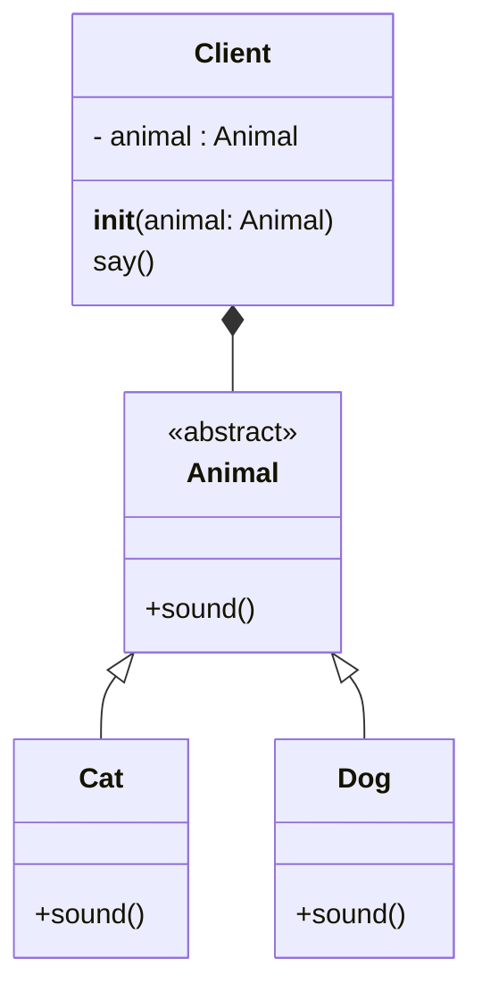

```mermaid

classDiagram
    class Animal {
        +sound()
    }
    <<abstract>> Animal

    class  Cat {
        +sound()
    }

    class Dog
    Dog : +sound()

    class Client{
        - animal : Animal
        __init__(animal: Animal) 
        say()
    }

    Animal <|-- Cat
    Animal <|-- Dog
    Client *-- Animal
    
    
     

```

+ public var
- private var
# protected var

<|-- cat and dog inherit Animal

client has-a !.e composition relation with AnimalClass
*-- (composition)